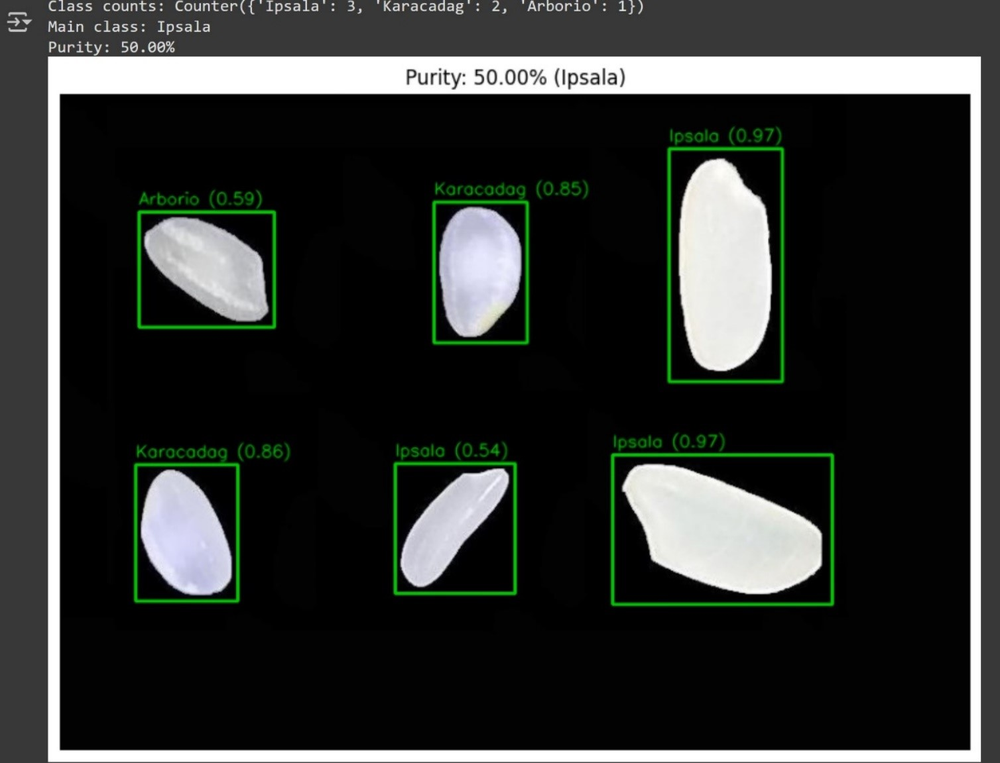
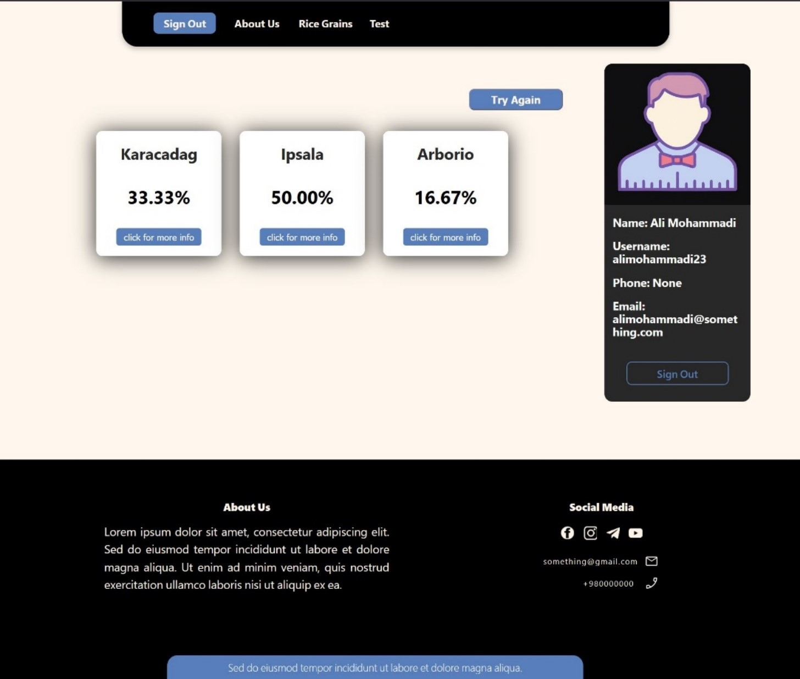

# Rice_Grain_Purity

Design and implementation of a machine learning system for classifying rice grain varieties and measuring purity using computer vision and deep learning. The system classifies rice grains into five different varieties. A deep learning model was built and trained using TensorFlow in Google Colab, and then deployed as a web application with a React frontend and a FastAPI backend.

---

## Dataset

The dataset used in this project is the **Rice Image Dataset** from Kaggle: https://www.kaggle.com/datasets/muratkokludataset/rice-image-dataset

---

## Output

## UI

